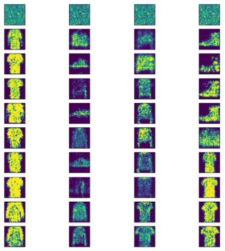

# GAN
# Generative Adversarial Networks

Pytorch implementation of GAN(Generative Adversarial Networks) using the MNIST and FashionMNIST dataset

## Final Report
Notion: https://ntb2001.notion.site/GAN-Final-Report-89bc730fda65408391216fff80f08b91

## Results

| MNIST | FashionMNIST |
|:--------:|:--------:|
|  |  |
|  |  |
|  |  |

1. "Generative Adversarial Networks": https://arxiv.org/pdf/1406.2661.pdf
2. Tutorial for coding: https://github.com/udacity/deep-learning-v2-pytorch/tree/master/gan-mnist
